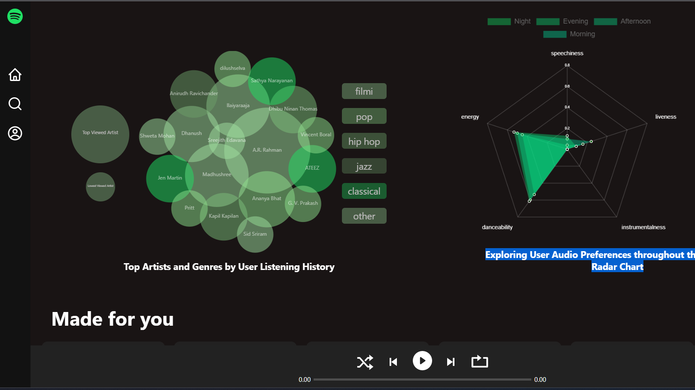

# Spotivize

A Spotify clone that visualizes user audio preferences with D3.js.

## Live Demo

Check out the live demo [https://spotivize.netlify.app](https://spotivize.netlify.app)

## Technologies

- ReactJS
- Redux
- D3.js
- Chart.js

## Features

- Login with Spotify account
- Personalized dashboard for data visualization
- Visualize data with D3.js
  - Exploring User Audio Preferences throughout the Day with a Radar Chart
  - Top Artists and Genres by User Listening History (bubble chart)
  - Weekly Overview: Time Spent Listening to Music on Spotify (bar chart)
  - Hourly Average Time Spent Listening to Music on Spotify( a donut chart)
- Display user's playlists, tracks, and recent plays
- Play tracks when user clicks on any cards
- Play/pause, next and prev, from real-time API data
- Search for tracks, albums, and artists
- Logout

## Screenshots

## Usage
- Login with Spotify account
- Navigate to different sections using the sidebar
- Search for tracks, albums, and artists
- View visualizations on the dashboard
- Logout

## getting started

1. Clone the repository
2. Install dependencies: `npm install`
3. Create a Spotify developer account and create an app
4. Add `https://spotivize.netlify.com` as the redirect URI in your Spotify app settings
5. Copy the client ID from your Spotify app dashboard and add it to your `.env` file as `REACT_APP_CLIENT_ID`
6. change the redirect uri to http://localhost:3000/ at login.jsx
7. Start the app: `npm start`
